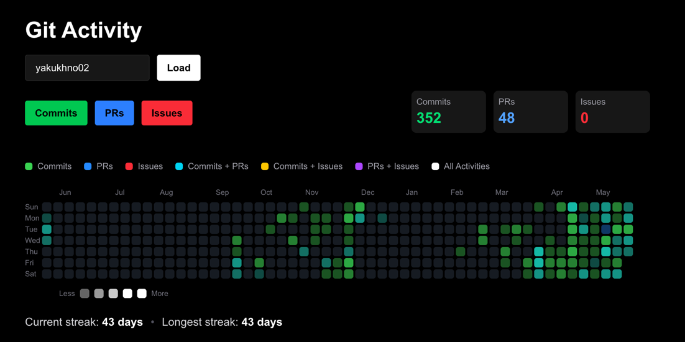

# Git Activity Heatmap

Interactive GitHub activity visualizer built with Next.js and TypeScript.

## Navigation

- [Features](#features)
- [Demo](#demo)
- [Add Git Activity to Your GitHub Profile](#add-git-activity-to-your-github-profile) ⭐️
- [Tech Stack](#tech-stack)
- [Local Setup](#local-setup)
- [Deployment](#deployment)

## Features

- GitHub contribution heatmap
- Commits, Pull Requests and Issues tracking
- Activity filters
- Current and longest streak calculation
- Shareable profile URLs
- GitHub GraphQL API integration
- SVG card for GitHub profile README

## Demo

Live demo:

https://git-heatmap.vercel.app

Example profile:

https://git-heatmap.vercel.app/yakukhno02



## Add Git Activity to Your GitHub Profile

Add this image to your GitHub profile `README.md`:

```md

```

Replace `YOUR_GITHUB_USERNAME` with your GitHub username.

Example:

```md

```

Optional dashboard link:

```md
[Open Git Activity Dashboard](https://git-heatmap.vercel.app/YOUR_GITHUB_USERNAME)
```

Example:

```md
[Open Git Activity Dashboard](https://git-heatmap.vercel.app/yakukhno02)
```

## Tech Stack

- Next.js
- TypeScript
- React
- Tailwind CSS
- GitHub GraphQL API
- Vercel

## Local Setup

```bash
git clone https://github.com/yakukhno02/git-activity.git
cd git-activity
npm install
```

Create `.env.local`:

```env
GITHUB_TOKEN=your_github_token
```

Run development server:

```bash
npm run dev
```

Open:

```txt
http://localhost:3000
```

## Deployment

The project is deployed on Vercel and automatically updates after every push to the `main` branch.
